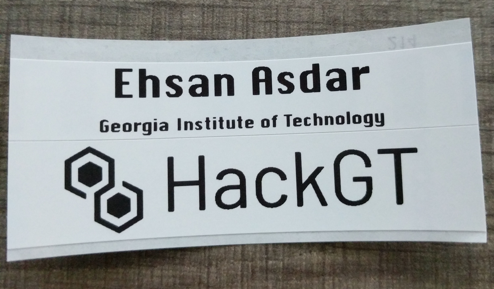

# HackGT Check-In Label Printing

Prints name labels for event badges at HackGT events.

Integrates with HackGT's [registration](https://github.com/HackGT/registration) and [Android check-in](https://github.com/HackGT/Checkin-Android) projects.

Participants scan their NFC badge at the label printing station and this software will use a Brother QL-700 printer loaded with 12mm continuous tape to print a label containing name and school in addition to a bonus HackGT sticker on the normally unusable portion of the label.

Rendered label example: 

Printed example: 
